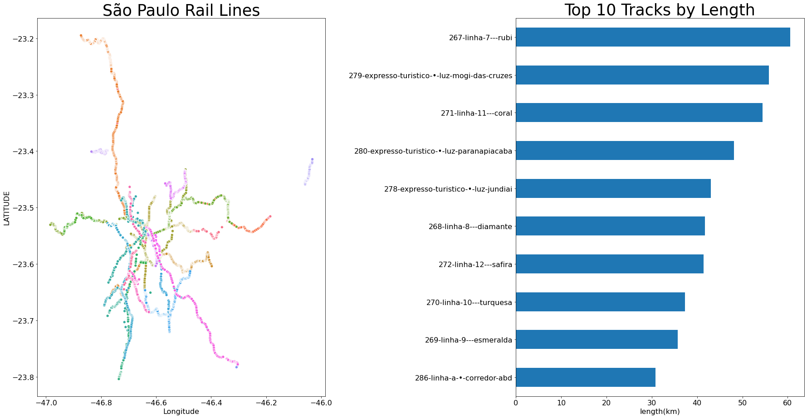

# Transit Density for Focused Investment
We are tasked with identifying the availability of transit lines in different countries as a first step toward determining potential locations for investment in public transit.

## Data
We are using the [**Transit Sytems of the World** data from Kaggle](https://www.kaggle.com/citylines/city-lines). This data was created in 2017 and last updated on March 25, 2019. 

## Features
The available data includes seven csv files *cities*, *lines*, *station_lines*, *stations*, *systems*, *track_lines*, *tracks* which share the *key city_id*.

### Features of Interest
The columns best suited to answer our question are:
- **City ID/Name**: from the [*cities*](https://www.kaggle.com/citylines/city-lines?select=cities.csv) dataset
  * We used the city names to merge multiple dataset together.\
- **Country**: from the [*cities*](https://www.kaggle.com/citylines/city-lines?select=cities.csv) dataset
  * We used the country names to aggregate data\
- **Track Length**: Length of all transit lines, reported by line. From the [*tracks*](https://www.kaggle.com/citylines/city-lines?select=tracks.csv) dataset

### Missing Data 
Happily, missing data was not a problem in this dataset. For future projects please note: there is significant missing data in *country_state* from the *cities* dataset.

### Correlation
- We were able to track density by aggregating line-length sums for all stations by country with only the *track length* feature so correlation was not relevant. 

### Results 
We determined the length of track by country. 

The small amount of transit line in South American countries caught our attention. We are fortunate enough to have Pedro, straight out of Brazil, on our team. Pedro explained [some interesting history](https://dialogochino.net/en/infrastructure/30573-chinese-rail-advances-slowly-in-latin-america/)....

## The transit system in Sao Paulo, Brazil
[Code that helped us](https://www.kaggle.com/a03102030/visualization-for-tokyo-osaka-new-york/comments#notebook-container)

### Conclusions
Having this information allows further exploration into where investment is potentially needed. The deficiencies in South America also create an opportunity for geographically efficient investment. 

### Future Work
For those with interest in transportation and/or South America there is a good capstone project here. We are interested in the idea of comparing transit lines and roads,

# Thank you for listening to us :)

