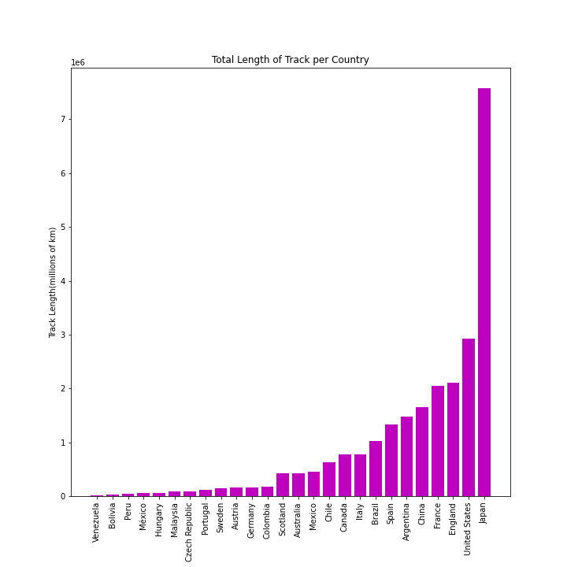

# Transit Density for Focused Raw Material Sales Growth
We are tasked with identifying the length (km) of transit lines in different locations around the world, as a first step toward determining potential growth markets for raw material sales.

## Data
We are using the [**Transit Sytems of the World** data from Kaggle]https://www.kaggle.com/citylines/city-lines). This data was created in 2017 and last updated on March 25, 2019. 

## Features
The available data includes seven csv files *cities*, *lines*, *station_lines*, *stations*, *systems*, *track_lines*, *tracks* which share the *key city_id*.

### Features of Interest
The columns best suited to answer our question are:
- **City ID/Name**: from the [*cities*]https://www.kaggle.com/citylines/city-lines?select=cities.csv) dataset
  * We used the city names to merge multiple dataset together.\
- **Country**: from the [*cities*](https://www.kaggle.com/citylines/city-lines?select=cities.csv) dataset
  * We used the country names to aggregate data\
- **Track Length**: Length of all transit lines, reported by line. From the [*tracks*](https://www.kaggle.com/citylines/city-lines?select=tracks.csv) dataset
  * Our *track length* data is numeric measure in kilometers per line. Our graphics are in millions of km,
- (maybe **Year Built**: the year a given station was built. From the [*stations*](https://www.kaggle.com/citylines/city-lines?select=stations.csv) dataset)
- (maybe **Station Name/ID**: The names of the stations in the dataset. From the [*stations*](https://www.kaggle.com/citylines/city-lines?select=stations.csv) dataset)

### Missing Data 
Happily missing data was not a problem in this dataset. The [*country_state* feature in the *cities* dataset](https://www.kaggle.com/citylines/city-lines?select=cities.csv) has multiple missing values but was unnecessary for our analysis. (maybe drop 3 missing values in *start year* from the *cities* dataset)

### Correlation
- We were able to track density by aggregating line length sums for all stations by country with only the *track length* feature so correlation was not relevant. 
- Additionally, for the country with the most lines of track, we compared the *year built* to the *track length* in hopes of exploring the possibility of a correlation that would predict good markets for focusing futures sales (see future work).

### Results 
We determined the length of track by country.

The small amount of transit line in South American countries caught our attention. We are fortunate enough to have Pedro, straight out of Brazil, on our team. Pedro explained [some interesting history](https://dialogochino.net/en/infrastructure/30573-chinese-rail-advances-slowly-in-latin-america/).

### Challenges

### Future Work
We 
